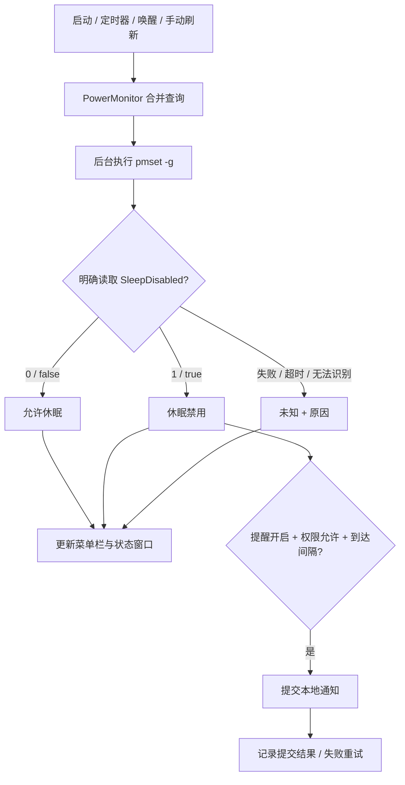

# 休眠哨兵设计

## 目标与范围

应用回答一个具体问题：`pmset -g` 返回的系统级 `SleepDisabled` 开关，当前是否明确处于禁用休眠状态？v1.1.0 在监测之外，增加仅由用户主动点击触发的恢复操作。

界面使用“允许休眠”“休眠禁用”“未知”三种结果。这里的“允许休眠”仅描述该开关，不能扩展为电脑已经睡着或合盖一定进入睡眠。应用不追踪设置修改者、不读取其他应用配置，不因检测到禁用而自动修改设置，也不提供保持唤醒功能。

检测路径只读。用户配置提醒时会保存本应用偏好；用户操作登录启动时会向系统注册或注销登录项；用户点击恢复时，经 macOS 管理员授权执行固定恢复命令。恢复不安装常驻 root 进程或 helper，不修改 `sudoers`，不读取或保存密码。源码不包含网络请求或远程服务。

## 组成

| 文件 | 职责 |
| --- | --- |
| [App.swift](../App.swift) | AppKit 菜单栏、状态窗口、提醒策略、通知权限、登录项、恢复流程及诊断入口 |
| [PowerMonitor.swift](../PowerMonitor.swift) | 后台读取 `pmset`、解析、查询合并和超时处理 |
| [PowerMonitorTests.swift](../PowerMonitorTests.swift) | 确切字段、合法值和未知输出的解析边界检查 |
| [SleepRecovery.swift](../SleepRecovery.swift) | 固定授权脚本、后台执行、请求合并、取消与超时 |
| [RecoveryPresentation.swift](../RecoveryPresentation.swift) | 执行结果与新读数组合的恢复文案 |
| [SleepRecoveryTests.swift](../SleepRecoveryTests.swift) | 不触发实际授权的执行替身与结果边界检查 |
| [Info.plist](../Info.plist) | 应用标识、版本、最低 macOS 版本和菜单栏应用配置 |
| [build.sh](../build.sh) | 使用系统 Swift 工具链构建 `.app` 并进行本地签名 |
| [test.sh](../test.sh) | 编译并执行独立解析器检查 |
| [package.sh](../package.sh) | 构建 ZIP，并对解压后的应用重新检查签名 |



## 读取与并发

`PowerMonitor` 直接启动 `/usr/bin/pmset`，参数固定为 `-g`，不通过 shell 拼接命令。子进程环境固定为 C 语言环境，并将标准输入关闭；标准输出和标准错误合并到同一个管道，避免未消费的独立错误管道阻塞进程。

查询管理运行在专用串行队列上；子进程启动、读取和等待退出运行在后台队列，主线程负责呈现结果。若一次检查尚未完成，新请求附加到同一查询，结果统一回到主队列，避免多次菜单点击或定时事件堆积子进程。

查询期限为 3 秒。期限到达时，若子进程仍运行，应用结束自己的这一个只读查询进程，并返回“未知”。查询标识用于忽略迟到的旧结果；如果启动操作在期限后才返回，也会清理迟到进程。这个超时处理不会结束其他应用。

## 解析契约

只识别大小写准确的 `SleepDisabled` 字段，不把 `SleepDisabledFuture` 等相似名称当作目标字段。值允许 `0`、`1`、`false`、`true`，其中布尔值不区分大小写；允许空白、`=` 或 `:` 分隔。

空输出、字段缺失、值缺失、未知值、合法值后的额外文本，以及同一输出中互相冲突的字段值均返回“未知”。相同意义的重复字段允许通过。命令非正常退出、非零退出或 UTF-8 解码失败也返回“未知”，不会默认显示“允许休眠”。

`SleepCheckResult.checkedAt` 记录检查完成时间，包括失败与超时。它不是电源设置的修改时间。

## 刷新与状态

正常运行时，定时器目标间隔为 10 秒，允许 2 秒调度容差；实际执行可能受系统调度及应用运行状态影响。启动、打开菜单、手动检测、应用重新成为活动应用，以及收到系统唤醒通知时均发起检查。

| 新结果 | 展示与后续行为 |
| --- | --- |
| `disabled`，上一已知状态不是禁用 | 开始新的禁用事件，记录检测时间，清除该事件的提醒时间并判断是否提交提醒 |
| `disabled`，上一已知状态仍是禁用 | 保持事件，按提醒间隔决定是否再次提交 |
| `allowed` | 显示允许休眠，清除禁用事件与提醒时间；若此前已知为禁用，移除本应用的禁用通知 |
| `unknown` | 显示未知及错误原因，暂停根据旧状态提交新提醒；保留上一已知状态用于后续变化比较 |

读取失败期间发生的真实设置变化可能无法还原。恢复读取后，应用只依据新读数和上一已知状态继续工作，不补造变化时间或事件。状态历史仅在内存中保留本次运行最近五条已知状态变化或恢复结果。

## 提醒策略

自动提醒必须同时满足：最新读数为禁用、用户开启自动提醒、通知授权允许、没有正在提交的自动提醒，并且达到提醒间隔或首次提醒条件。

默认重复间隔为 30 分钟；用户可选只首次提醒或 5、15、30、60 分钟。只有通知请求提交成功后才记录该事件的提醒时间。提交错误显示在界面，使用独立的 60 秒失败重试节流；失败不会耗尽“只首次提醒”的机会。

每个禁用事件有独立标识，通知完成回调会核对标识，避免旧请求污染新事件的提醒时间。恢复允许状态时，会清理标识为 `sleep-disabled` 的已投递与待投递通知。手动测试通知使用独立标识，不改变自动提醒时间。

取得临时静默授权时，应用可提交静默通知，并在界面明确提示该权限状态。通知授权、请求提交和用户实际看到横幅是三个不同事实：应用只据 API 返回值判断授权及提交结果，不宣称已确认横幅显示。

## 一键恢复契约（v1.1.0）

菜单和状态窗口共用“恢复休眠”动作，点击后直接进入等待系统授权，不另设应用确认框。当前明确为允许休眠时按钮禁用；未知或禁用时可操作。由 macOS 的系统管理员授权界面处理凭据，应用不提供自己的密码输入框。正常检测、自动通知、登录启动和诊断接口不会自动调用恢复。

授权执行的目标命令固定为 `/usr/bin/pmset -a disablesleep 0`。不接收用户输入作为命令、路径或参数，也不提供任意特权执行入口。授权、执行和等待在后台异步处理；按钮和内部状态同时防止重叠的恢复请求。读取操作的 3 秒超时不应套用到可能需要等待用户输入的系统授权阶段。

恢复由 `/usr/bin/osascript` 执行固定 AppleScript，其中仅一次 `do shell script` 使用系统管理员授权，未携带用户名或密码。默认恢复等待期限为 120 秒。超时结束本应用的授权子进程，结果按未确认处理；它不能撤销已开始执行的特权命令。

固定脚本限制错误消息长度；授权进程结束后，以非阻塞方式读取管道当前已有的输出，不等待可能被其他进程保留的写端产生 EOF。读取结果有长度上限，退出码、信号终止和明确结果标记共同用于分类，不以模糊的取消文字或空输出推断成功。

机制参考：[Apple TN2065：do shell script 与管理员权限](https://developer.apple.com/library/archive/technotes/tn2065/_index.html)、[AppleScript 错误码](https://developer.apple.com/library/archive/documentation/AppleScript/Conceptual/AppleScriptLangGuide/reference/ASLR_error_codes.html)。这些是 Apple 归档说明，提供机制与错误分类依据，不能替代当前目标 macOS 的实机验收。

恢复开始时暂停常规查询，并递增查询代次，忽略操作前尚未返回的旧查询回调。所有执行结果都使用独立 `verificationMonitor` 的新查询检查当前值；它不会合并普通监测中已有的查询。该新读数也用于刷新菜单栏。超时后的读取是在等待结束之后发起，并不证明已经开始的系统命令一定彻底结束。

| 恢复阶段或结果 | UI 与判定 |
| --- | --- |
| 等待系统授权 / 执行中 | 显示进行状态，禁用重复恢复入口；其他界面保持响应 |
| 用户取消授权 | 显示已取消，不宣称成功，不自动再次请求 |
| 授权或执行失败 | 显示失败原因，不宣称成功；再次尝试需用户点击 |
| 等待超时 | 显示本次操作完成情况未确认，重新读取当前值；即使读到 `0` 也不报告本次操作成功 |
| 执行无错误，准备确认 | 发起写入结束之后的新 `pmset -g` 查询，不能使用执行前结果或合并中的旧查询作确认 |
| 新结果为 `allowed` | 更新监测状态并显示开关已恢复；清理禁用通知 |
| 新结果为 `disabled` | 显示仍禁用，不报告恢复成功 |
| 新结果为 `unknown` | 显示无法确认恢复结果与读取原因，不报告恢复成功 |

所有执行结果都进入重新检测。恢复成功的依据同时包括固定命令正常完成，以及完成之后取得的新明确读数 `0`；不能只依据授权成功、退出码为零或本来存在的绿色状态。取消、失败或超时配合新读数 `0` 时，只说明系统当前允许休眠，不确认本次恢复操作成功。恢复结果不确认电脑已经睡着，也不保证合盖效果；后续状态仍以正常监测的最新结果为准。

本节是 v1.1.0 的实现与验收契约。系统授权成功、真实 `1 → 0` 转换和合盖实测尚需证据，不应由旧版监测检查推导为通过。见[验证记录](VALIDATION.md)。

## 首次启动与系统集成

首次启动打开状态窗口，说明当前状态并提供“启用通知”和“测试提醒”。通知授权由用户操作触发。首次直接使用测试功能时，保存测试意图，待权限查询取得明确结果后决定是否发送；授权仍未决定时不清除该意图。

应用使用 `SMAppService.mainApp` 管理登录项。`enabled` 表示系统登记为可运行，`requiresApproval` 表示仍需用户批准；界面根据系统状态呈现。注册 API 成功或状态为 `enabled` 均不能代替实际下一次登录后的启动验证。

应用采用 accessory 激活策略，并在 `Info.plist` 中声明 `LSUIElement`，主要呈现位于菜单栏。使用相同 bundle identifier 的应用已运行时，新启动实例退出，避免重复监测。

状态窗口使用 `NSScrollView` 容纳全部内容，并采用从顶部排列的文档视图。文档宽度跟随可见区域，多行说明限制到内容列宽，垂直内容由自身高度撑开，以便长错误和历史记录能够滚动查看。窗口内容高度上限为 840 点，并依据当前屏幕可用高度缩短。该布局已通过静态复核和构建；新版真实滚动、长文案及不同缩放仍待界面验收。

偏好由 `UserDefaults` 保存：是否已首次启动、自动提醒是否开启和重复提醒分钟数。检测结果、状态历史、禁用事件时间、提交状态、恢复进行状态和错误不写入持久日志；管理员凭据不进入这些偏好。

## 诊断接口

以 `--diagnose` 启动可执行文件时，只进行一次只读检查，输出 JSON 后退出，不创建菜单栏或请求通知权限。

```json
{"checkedAt":"2026-01-01T00:00:00Z","status":"allowed"}
```

上例为格式示例，不是实机记录。`status` 为 `allowed`、`disabled` 或以 `unknown: ` 开头的错误说明。已知结果的退出码为 `0`，未知结果的退出码为 `1`。

## 当前限制

应用不检测盖子传感器、睡眠日志、外接显示器状态或其他进程的电源断言，因此不会归因软件或解释所有睡眠问题。应用退出、尚未登录或系统睡眠时不持续执行监测。定时读取之间出现又消失的开关变化可能漏过。

构建使用本地 ad-hoc 签名。签名校验不能代替 Developer ID 签名、Apple 公证、通知横幅验证或跨版本兼容性验证。具体已验证与待验证项目见[验证记录](VALIDATION.md)。
